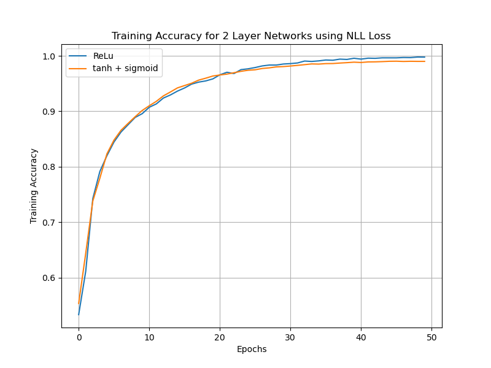
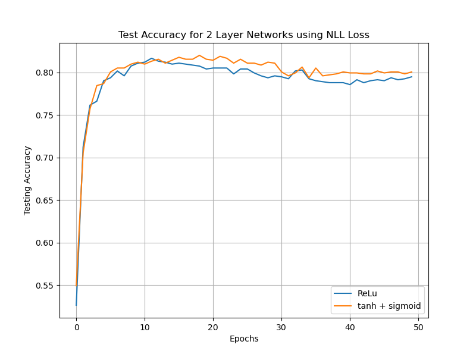
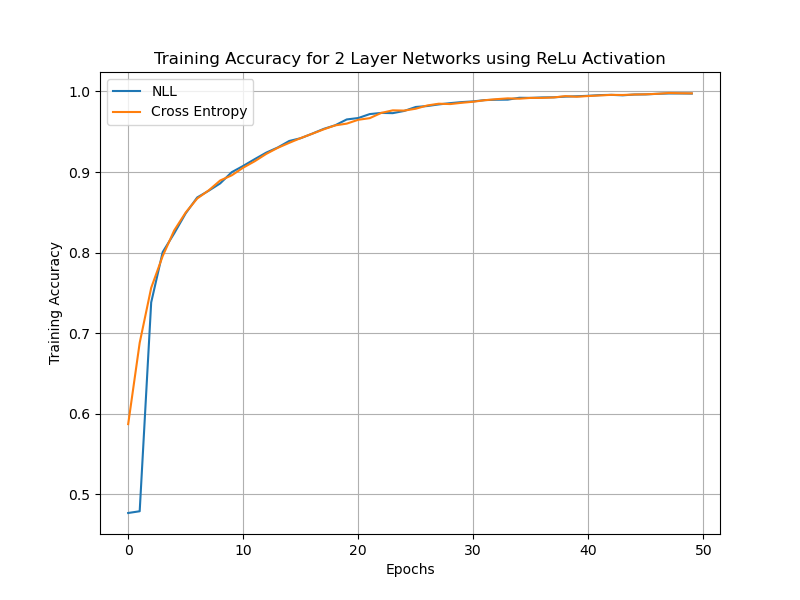
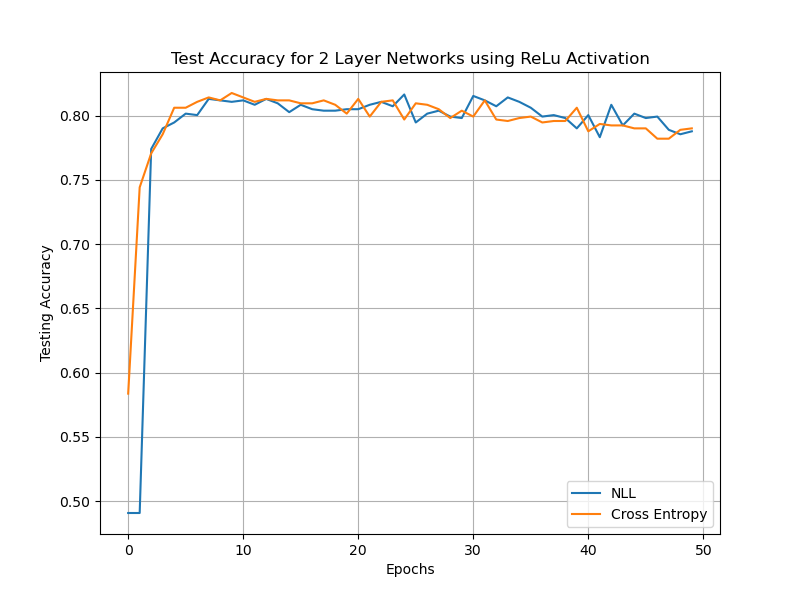

# Deep Averaging Network (DAN) for Sentiment Analysis

This project implements a **Deep Averaging Network (DAN)** for sentiment analysis using subword tokenization with Byte Pair Encoding (BPE). The goal is to classify text data into positive or negative sentiment categories while exploring the effectiveness of DAN models in handling sentiment classification tasks.

## Key Features

1. **Deep Averaging Network (DAN):**
   - Implements a DAN model for sentiment classification.
   - Uses subword tokenization with Byte Pair Encoding (BPE) for better handling of rare words and subword units.

2. **Data:**
   - The dataset includes training and development files (`train.txt`, `dev.txt`) with labeled sentiment examples.

3. **Visualization:**
   - Training and testing accuracy are visualized across epochs using matplotlib.

4. **Preprocessing:**
   - Includes utilities for tokenizing text, handling subword units, and preparing data for training.

## Findings and Results

The project demonstrates the effectiveness of DAN models in sentiment analysis. Below are some key findings:

1. **Training and Testing Accuracy:**
   - The model achieves consistent improvements in accuracy over epochs for both training and testing datasets.

2. **Visualization of Results:**
   - The following figures illustrate the training and testing accuracy across epochs:

<p align="center">
  
  
</p>

<p align="center">
  
  
</p>

3. **Claims:**
   - Subword tokenization improves the model's ability to generalize to unseen data.
   - DAN models are computationally efficient and effective for sentiment classification tasks.

## How to Run

1. **Install Dependencies:**
   Ensure you have Python installed along with the required libraries. Install dependencies using:
   ```bash
   pip install -r requirements.txt
   ```

2. **Train the Model:**
   Run the following command to train the DAN model:
   ```bash
   python DANmodels.py --model 1b
   ```

3. **Visualize Results:**
   The training and testing accuracy plots will be saved in the `images/` directory.

## Conclusion

This project highlights the simplicity and effectiveness of Deep Averaging Networks for sentiment analysis. By leveraging subword tokenization, the model achieves robust performance on text classification tasks, making it a valuable tool for natural language processing applications.
